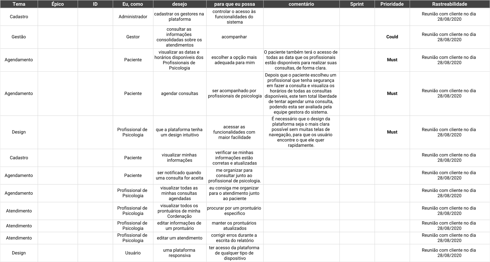

# Backlog

## Histórico de Versões
| Data     | Versão   | Descrição | Autor(es) |
|:----------:|:--------:|:----------------------:|:---------------------------:|
| 01/09/2020 |   0.1    | Criação do Documento de Backlog  |   João Pedro  |

## 1. Introdução

A partir de uma _baseline_ de requisitos bem fundamentada, é possível definir um _backlog_ bem estruturado a partir do qual o desenvolvimento pode obter maior sucesso. É importante lembrar, entretanto que o _backlog_ do produto é um artefato _SCRUM_ constantemente refatorado, devido à volatilidade dos requisitos dos _stakeholders_, dessa maneira, as diversas modificações podem ser vistas pelo histórico do [drive](https://docs.google.com/spreadsheets/d/1KaAB7QSrFc_kLbJjvetrwGHoPdRTF6AQEjbenxx-FSM/edit?usp=sharing) (Google Drive).

## 1.1. Propósito

O presente documento tem como propósito apresentar o _product backlog_ do _software_ a ser desenvolvido, cujo nome ainda será definido, trazendo as histórias de usuários e os seus critérios de aceitação. Espera-se a partir desse _backlog_ conseguir planejar as _sprints_ (conforme a metodologia estabelecida) a serem executadas até o prazo final da melhor forma possível.

## 1.2. Escopo

O escopo do _product backlog_ considera as histórias selecionadas a partir dos requisitos elicitados, a serem desenvolvidos até o fim do prazo de entrega do projeto. Assim, optou-se por dividir em módulos e apresentar os critérios de aceitação da histórias a serem entregues. 

## 2. Objetivo

Objetiva-se, para a construção do backlog, utilizar a modelagem de requisitos relacionando as histórias de usuário que representam as características necessárias ao _software_ a ser desenvolvido, proposto pelo time. Espera-se obter assim uma consolidação da _baseline_ de requisitos, disponibilizando uma relação pronta para ser implementada. 

## 3. Metodologia

Primeiramente, foram recolhidos os requisitos obtidos a partir da proposta de projeto e da entrevista realizada com as integrantes para orientar a criação do _backlog_ do produto. A priorização foi feita pela equipe de estudantes da disciplina de Engenharia de Produto de Software com base a escolha feita pelas integrantes do projeto.

## 4. _Product Backlog_

Devido ao curto tempo de desenvolvimento da aplicação pela equipe, foi preciso reduzir o escopo da aplicação de maneira a compor as partes principais que poderiam ser entregues até a data final estabelecida para o projeto. Dessa forma, o [backlog original](https://docs.google.com/spreadsheets/d/1tk3AKKslzvp-USAvyrjODCVK4mIj8pOG7cYVpn8alOA/edit?usp=sharing) foi dividido em dois: o presente e o futuro para as próximas iterações. As imagens podem ser visualizadas abaixo. 

O _Product Backlog_ pode ser acessado através desse link: https://docs.google.com/spreadsheets/d/1KaAB7QSrFc_kLbJjvetrwGHoPdRTF6AQEjbenxx-FSM/edit?usp=sharing

### 4.1. _Product Backlog_ (Presente)

### 4.2. _Product Backlog_ (Futuro)

## 5. Referências 

 * Desenvolvimento ágil. [Product Backlog](https://www.desenvolvimentoagil.com.br/scrum/product_backlog). 
