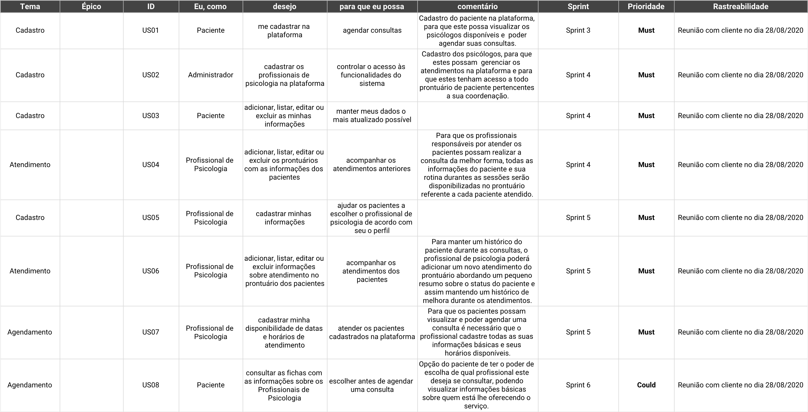

# Backlog

## Histórico de Versões
| Data     | Versão   | Descrição | Autor(es) |
|:----------:|:--------:|:----------------------:|:---------------------------:|
| 01/09/2020 |   0.1    | Criação do Documento de Backlog  |   João Pedro  |
| 03/10/2020 |   0.2    | Revisão do Documento de Backlog  |   João Pedro  |

## 1. Introdução

 A partir de um levantamento de requisitos bem fundamentado, é possível definir um <i>backlog</i> bem estruturado a partir do qual o desenvolvimento pode obter maior sucesso.
 

 O <i>backlog</i> do produto é um artefato <i>SCRUM</i> constantemente refatorado devido à volatilidade dos requisitos elicitados junto aos <i>stakeholders</i>, e, desta maneira, possui diversas modificações.</i> 

 Tais modificações podem ser consultadas através do histórico de versões presente no do documento do <i>backlog</i> armazenado na pasta do Google Drive. Ele pode ser acessado a partir do link abaixo:

[eSaudeUnB - Backlog](https://docs.google.com/spreadsheets/d/1KaAB7QSrFc_kLbJjvetrwGHoPdRTF6AQEjbenxx-FSM/edit?usp=sharing)

## 1.1. Propósito

 O presente documento tem como propósito apresentar o <i>product backlog</i> do <i>software</i> desenvolvido para a plataforma eSaúde UnB, trazendo as histórias de usuários e os seus critérios de aceitação. Espera-se a partir desse <i>backlog</i> conseguir planejar as <i>sprints</i> (conforme a metodologia estabelecida) a serem executadas até o prazo final da melhor forma possível.

## 1.2. Escopo

 O escopo do <i>product backlog</i> considera as histórias selecionadas a partir dos requisitos elicitados, a serem desenvolvidos até o fim do prazo de entrega do projeto. Assim, optou-se por dividir em módulos e apresentar os critérios de aceitação da histórias a serem entregues.

## 2. Objetivo

 Objetiva-se, para a construção do <i>backlog</i>, utilizar a modelagem de requisitos relacionando as histórias de usuário que representam as características necessárias ao <i>software</i> a ser desenvolvido, proposto pelo time. Espera-se obter assim uma consolidação da elicitação de requisitos, disponibilizando uma relação pronta para ser implementada.

## 3. Metodologia

 Primeiramente, foram recolhidos os requisitos obtidos a partir da proposta de projeto e da entrevista realizada com as integrantes deste para orientar a criação do <i>backlog</i> do produto. A priorização foi feita pela equipe de estudantes da disciplina de Engenharia de Produto de Software com base a escolha feita pelas integrantes do projeto.

## 4. _Product Backlog_

 Devido ao curto tempo de desenvolvimento da aplicação pela equipe, foi preciso reduzir o escopo da aplicação de maneira a compor as partes principais que poderiam ser entregues até a data final estabelecida para o projeto. Dessa forma, o <i>Product Backlog</i> foi dividido em dois: o presente e o futuro para as próximas iterações. As imagens podem ser visualizadas abaixo.

 O <i>Product Backlog</i> pode ser acessado através do link abaixo:
 

https://docs.google.com/spreadsheets/d/1KaAB7QSrFc_kLbJjvetrwGHoPdRTF6AQEjbenxx-FSM/edit?usp=sharing

### 4.1. _Product Backlog_ (Presente)

### 4.2. _Product Backlog_ (Futuro)

## 5. Referências 

 * Desenvolvimento ágil. [Product Backlog](https://www.desenvolvimentoagil.com.br/scrum/product_backlog).